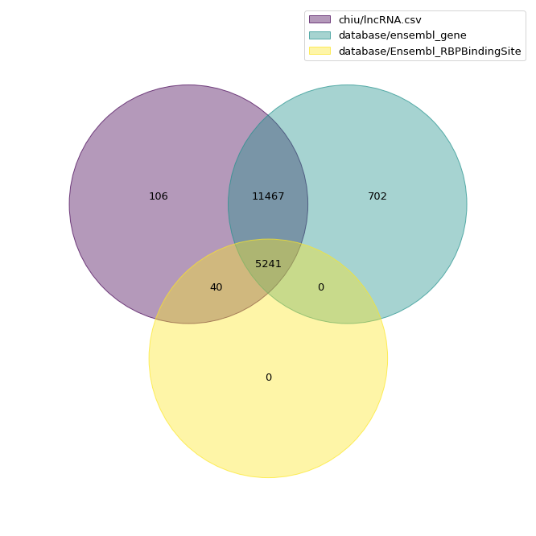
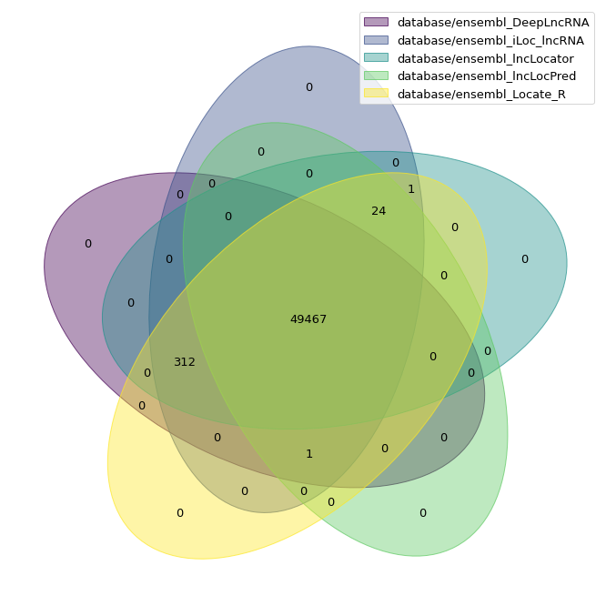
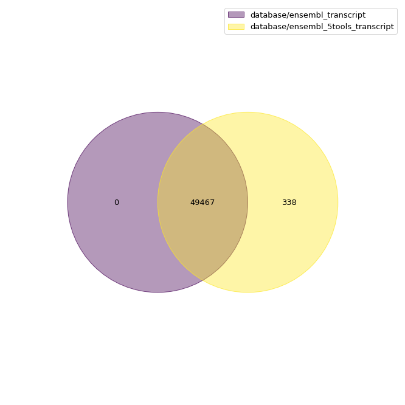
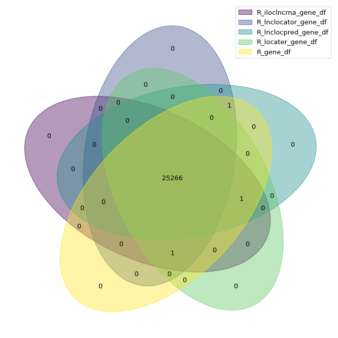

# Database

## Ensembl

### Ensembl Gene_name

- chiu/lncRNA.csv: 邱博士的 lncRNA.fasta
- database/ensembl_gene: database 裡有的 lnc gene，也就是在 5 tool 中有資訊的 lnc gene。
- database/Ensembl_RBPBindingSite: 有 RBP binding 的 lnc gene。

### Ensembl Transcript

- database/ensembl_transcript: database 中的 transcript。
- database/ensembl_5tools_transcript: 5 個 tool 的 transcript 結果的連集。

## RNAAtlas

### RNAAtlas Gene_name

### RNAAtlas Transcript

