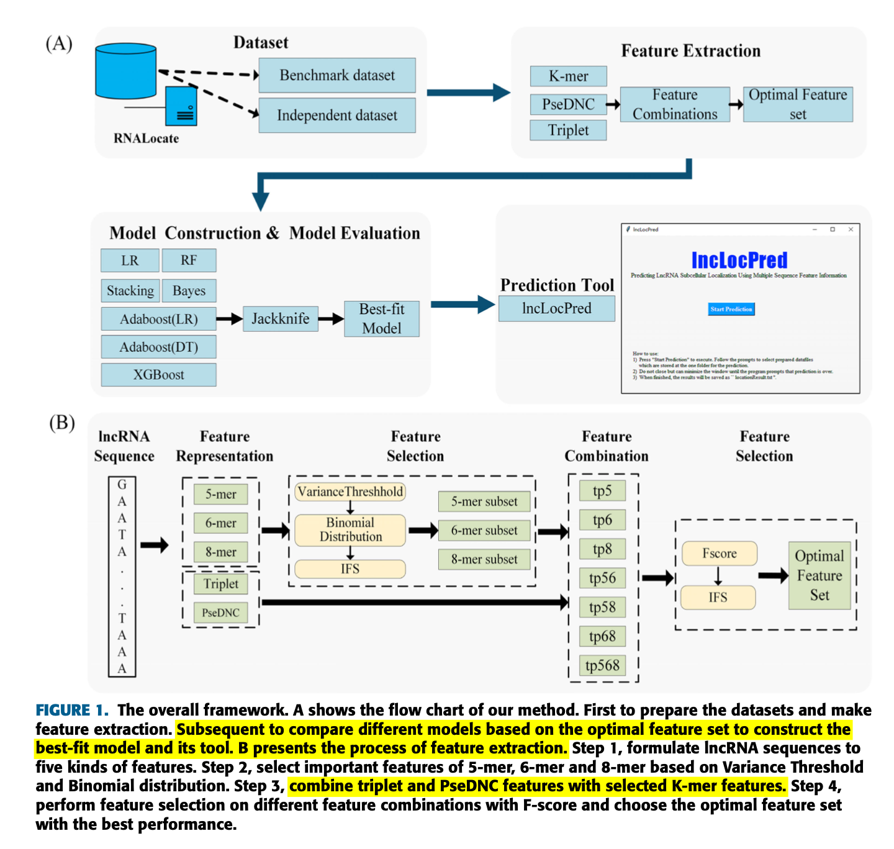
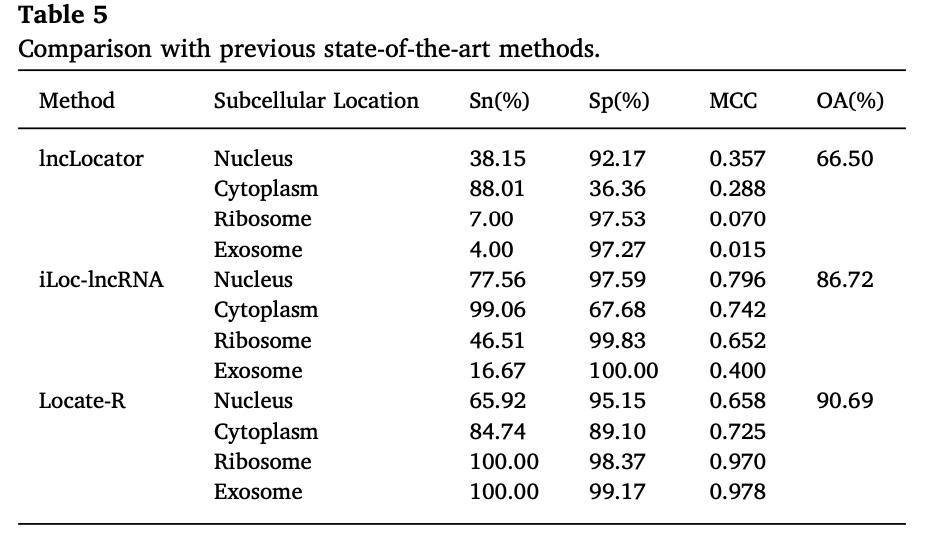

# location tools paper

## DeeplncRNA

---

- results
  - accuracy of 72.4%
  - sensitivity of 83%
  - specificity of 62.4%
  - area under the receiver operating characteristic curve of 0.787
- data
  - 93 RNA-seq sampes from 14 human, 45 cytosol, 48 nucleus
  - 4380 cytosolic lncRNAs and 4298 nuclear lncRNAs
  - 70/15/15
  - https://github.com/bgudenas/DeepLncRNA
- 用 DNN 預測

> sensitivity 敏感度（真陽性率）: 指有條件的人（根據“黃金標準”判斷）在該測試中獲得陽性結果的比例。
> specificity 特異度（真陰性率）: 是指沒有條件的人（根據“黃金標準”判斷）在該測試中得到陰性結果的比例。

細胞內部的運作是DNA產物（non-coding RNAs and proteins）之間精心編排且複雜的互相作用的。
這個想法已經取代了蛋白質及其相應的 RNAs(mRNAs) 僅負責細胞功能的觀點。
Non-coding RNAs 現在知道是基因組的一個完整系統功能，在基因表達調控上參與了關鍵作用。
在 non-coding RNAs 中最普遍使用且功能最多樣化的是 lncRNAs。

lncRNAs 是 not encode proteins 的轉錄，據估計其數量超過人類基因組豬的 protein-coding genes。
然而，lncRNAs 在序列水平上的保守性很差，這使得功能注釋變得困難。
lncRNAs 在許多不同的亞細胞位置執行多種基本分子功能。

## iLoc-lncRNA

---

- accuracy 86.72%
- data
  - 655 lncRNA sequences
  - 156 lncRNAs from nucleus, 426 samples from cytoplasm, 43 lncRNAs from ribosome, 30 lncRNAs from exosome.
  - http://lin-group.cn/server/iLoc-LncRNA/Supp-S1.txt , 找不到
- SVM

## lncLocator

---

- accuracy 59%
- data
  - from
    - http://www.rna-society.org/rnalocate
  - including cytoplasm, nucleus, cytosol, ribosome and exosome
  - 612 lncRNA
- RF, SVM
  - $RF^R, SVM^R RF^A, SVM^A$
  - $RF^R$ 原始RF
  - $SVM^R$ 原始SVM
  - $RF^A$ RF 使用 AE-based high-level features
  - $SVM^A$ SVM 使用 AE-based high-level features

## lncLocPred

---

- accuracy 92.37%
- data
  - from
    <!-- - RNALocate, paper -->
    - http://www.rna-society.org/rnalocate/
  - benchmark dataset
    - nucleus 156
    - cytoplasm 426
    - ribosome 43
    - exosome 30
  - independent dataset
    - nucleus 82
    - cytoplasm 199
    - ribosome 99
    - exosome 16
- model

## Locate-R

---

- results
  - accuracy 90.69%
    - cytoplasm 84.73%
    - exosome 100%
    - nucleus 65.92%
    - ribosome 100%

- data
  - from
    - http://www.rna-society.org/rnalocate/
  - 655 features
  - 923 lncRNA labelled subcellular localization
  - 426 cytoplasm, 344 nucleus, 314 ribosome, 240 exosom, ALL 1324
- model
  - feature extraction
    - $l$-mers
    - $n$-gapped $l$-mers
  - feature selection: 5,000
  - classification algorithms
    - LD-SVM
      - tree depth = 5
      - $W$ = 0.01
      - $\theta$ = 0.001
      - $\theta$' =0.001
      - $\sigma$ = .1
      - iterates = 15,000
    - Microsoft Azure
  - cross validation
