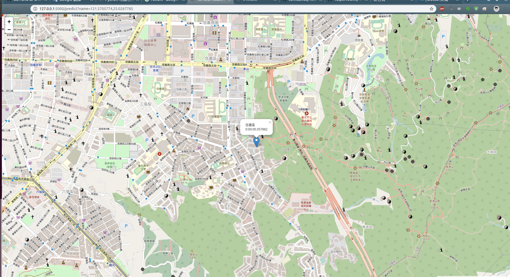

# docker 快速佈署

## git ssh

如果要製作快速佈署私人專案的 docker 會需要用到 SSH
如果用 HTTP 的方式的話會需要設成公開才能在 docker clone 所以需要使用 SSH。
把 SSH KEY 添加到 github 上在 User > Settings > SSH and GPG Keys 中 SSH Keys。

ssh key file

```
ssh-rsa AAAAB3NzaC1yc2EAAAADAQABAAABAQDMhHDIiCUJQvVfYQRKS97GfbJFtj45RPy3LONJVMiprxVD2rm6KA22c9IPypWH3igPkLfLtbxk0IMvBl04svxx1Ay/fc3rF/RRH3bEwB+mFzBpIdaKAUKnkzXmLxZjU0WoSdl9HLGioZkV1hKLcIfyc0ebW3DBuhZI0+bKU6BjPY5W5cNelj+ofZRoIU9o2PyqiWTeta81WO25fU/tZqMoKLXvVz0aAv5fHJwFBoCguJOZZ8rQepmE3AUh6yXjNMr/CcYmBXKiqOiW5e5s/YWlIvJLy+XbVsb4LCnbTBHQd99RYkPGc2j/uRHkbNHbltcsPDsC9f412LnpbQ9Gn0xN jiandenb@jiandenb-Aspire-V5-591G
```

## Python 專案

如果是 Python 的專案可以使用 pipenv file 的功能進行所需套件的安裝。
`pipenv install`

## docker file 製作

docker file 參數：
-	FROM：基底的映像檔（image）
-	WORKDIR：工作的資料夾（如果沒有會自己新增）
-	ADD：複製指定的檔案、目錄或遠端檔案 URL，將其加入映像檔檔案系統中的指定位置。
-	RUN：每一個 RUN 指令會在現有映像檔之上加入新的一層，是在建立 (build) 映像檔的過程中會執行的指令。
-	CMD：一個 Dockerfile 中只能有一個 CMD 指令，CMD 則是在容器運行時所執行的指令。

### dockerfile build image

`docker image build -t {image name} .`

刪除 image

`docker image rm {image ID}`

### 透過 image 執行 container

`docker run -d -p 80:8888 --name {container name} {image name}`

### container 操作

查看運作中 container 清單
`docker container ls `

查看所有 container 清單
`docker container ls -all`

查看 container log
`docker container logs {name}`

進入 container 操作
`docker exec -it {name} /bin/bash`

刪除指定 container

`docker rm {container ID}`

刪除未使用的 container

`docker system prune`


