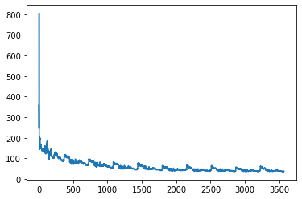
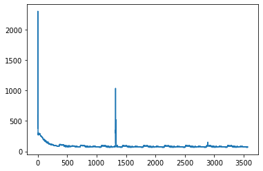
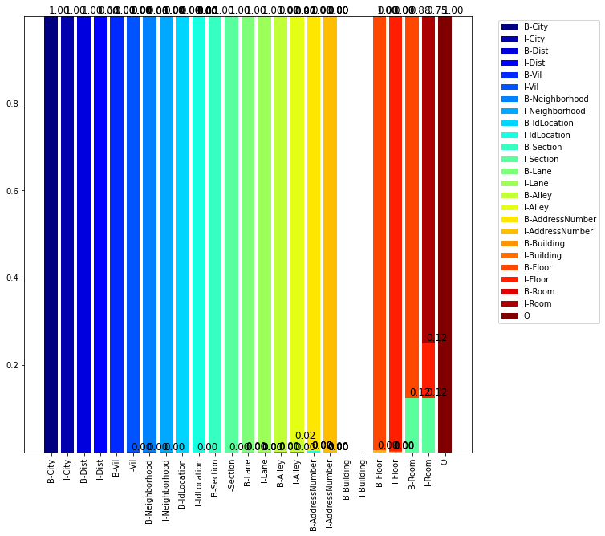

# 201016

以這篇論文所述
_How to Fine-Tune BERT for Text Classification?_
進一步 pre training 可以有更好performance

## Pre training 測試

### sample

- data : data/tw_testv1_bio.txt
  使用阿達正規資料抽取0.01%的小data作mask任務 pre training

bert-base-chinese

可以看出來確實有更好performance

### leraning rate and weight decay

#### bert-base-chinese

|l r\w d|0.00|0.25|0.50|0.75|0.95|
|-|-|-|-|-|-|
|2e-5||||||
|2e-4||||||
|2e-3||||||

#### self-pretraining

|l r\w d|0.00|0.25|0.50|0.75|0.95|
|-|-|-|-|-|-|
|2e-5||||||
|2e-4||||||
|2e-3||||||

## train confusion matrix

- data : data/tw_testv1_bio.txt

### bert-base-chinese (train)

- model folder : 1602828026.3357406
- train Loss : 25.283639907836914

### self-pretraining (train)

- model folder : 1602973603.119804
- train Loss : 23.61539649963379

## eval

- data : data/T_test_data.txt
  只有T大給的資料，有除了地址以外的文字備註。如：台中市南屯區文心路一段極限健身-文心店。

### bert-base-chinese (eval)

- files:
  - tag: data/tag/tag_v1.txt
  - train: data/tw_testv1_bio.txt
- hyperparameters:
  - batch_size: 128
  - epochs: 10
  - leraning_rate: 2e-5
  - max_len: 150
  - weight_decay: 0.5

train Loss : 25.283639907836914

Average Loss: 134.87498982747397

### self-pretraining (eval)

- files:
  - tag: data/tag/tag_v1.txt
  - train: data/tw_testv1_bio.txt
- hyperparameters:
  - batch_size: 128
  - epochs: 10
  - leraning_rate: 2e-3
  - max_len: 150
  - weight_decay: 0.0
- name: self-pretraining

train Loss: 23.61539649963379

Average Loss: 20.9879216088189

