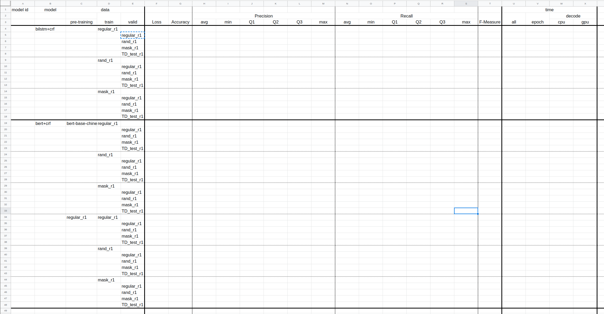

# 201023

## Model

- 完成評估大表格
  
  
  評估各個模型在各個訓練集的交叉測試。
  - Precision: 預測真的有多少實際也是真。
  - Recall: 實際是真的有多少預測也為真。
  - F-1: Precision 與 Recall 的綜合評估。
    公式: ( 2 \* Recall \* Precision ) / ( Recall + Precision )

- 開始照表格訓練

## Knowledge

- 斷詞
  
  找查中文斷詞的一些知識，希望可以幫助改進模型。
  先斷詞在進行判斷是什麼類別可能會有更好的performance。
