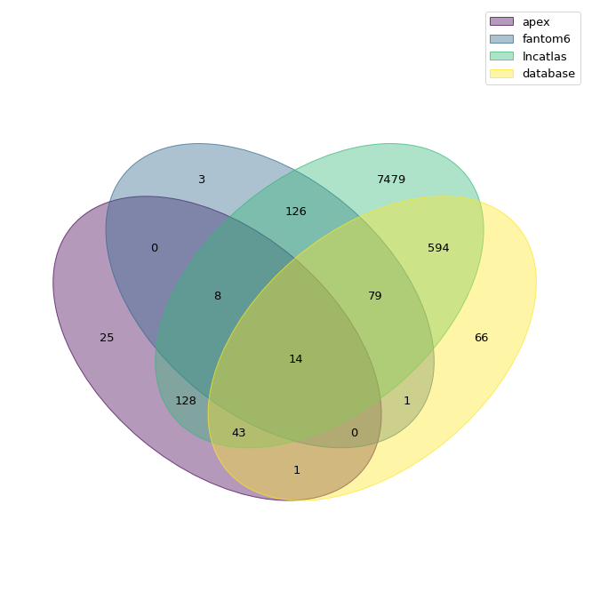

# 220927

- dodoweb
  - output3(lncRNA_location_expression) 數量
    - total: 8567
      
- pwm
  - rna-seq shuffle_count
    - ensembl: 9468
    - rnaatlas: 32200
  - seq rbp:
    - e8, e9, r9 - ing
  - jaccrad index
    - r7 確認
    - merge predict rbp
    - shuffle 要分 merge predict len
    - p val
      - (顯著%) > cutoff, 才是好的
      - 最小 0.0001

- rna location predict model
  - 4 classifier of last week
    - done.
  - nuc lncRNA nuc mRNA cyto mRNA
    indep: cyto lncRNA

10-fold CV:
nuc lncRNA+nuc mRNA+cyto mRNA 

indep:
cyto lncRNA

- hchiu@bcm.edu